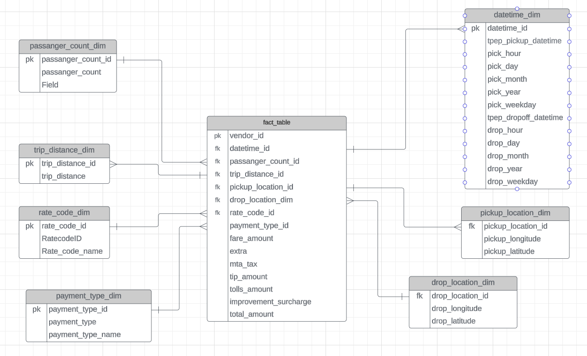

## Uber-Data-Pipeline-Project
The goal of the project is to build ETL pipeline in Python using jupyter notebook, python, GCP and Mage Data Pipeline

## Data Model

## Technology Used
Programming Language - Python 

GCP:
Google Storage 
Compute Istance

Data Pipeline Tool - https://www.mage.ai/

## Data Used:

https://github.com/AmikCS/uber-data/blob/main/uber_data.csv

1. Website - https://www.nyc.gov/site/tlc/about/tlc-trip-record-data.page
2. Data Dictionary - https://www.nyc.gov/assets/tlc/downloads/pdf/data_dictionary_trip_records_yellow.pdf
